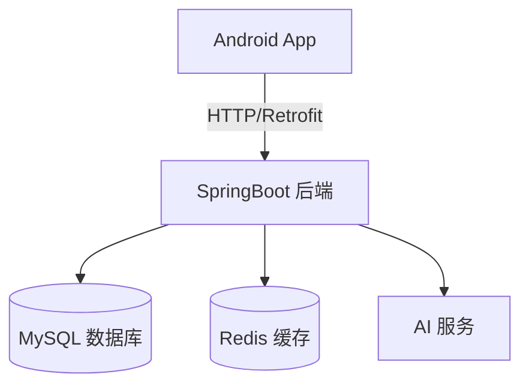

# CampusTask - 校园互助任务平台

## 项目简介

CampusTask 是一个面向大学校园场景的互助任务平台。  
用户可以在平台上发布各种校园生活任务，例如带饭、代拿快递、游戏开黑、学习互助等。  
其他用户可以抢任务并完成任务，从而获得系统奖励的积分。

该项目采用 **Android + SpringBoot** 的前后端分离架构，旨在实现一个简单但完整的校园任务撮合平台，并探索积分经济系统和用户信用评价机制。

项目地址：https://github.com/hx250000/School-Assistance-System，并可通过docker部署。

CI:
[](https://github.com/hx250000/School-Assistance-System/actions)

Backend Coverage:
[](https://codecov.io/gh/hx250000/School-Assistance-System)

Frontend Coverage:
[](https://codecov.io/gh/hx250000/School-Assistance-System)

---

## 项目目标

- 构建一个校园任务互助平台
- 实现任务发布与抢任务机制
- 设计积分奖励系统
- 提供积分商城兑换功能
- 建立用户信用评价体系

---

## 技术架构



**架构说明：**
- **前端**：Android 客户端，使用 Kotlin + MVVM 架构
- **后端**：SpringBoot 服务，提供 RESTful API
- **数据库**：MySQL 存储业务数据
- **缓存**：Redis 用于并发控制和缓存
- **AI**：集成 AI 服务生成任务描述


---

## 技术栈

### 前端（Android）

- Kotlin
- MVVM 架构
- Retrofit 网络请求
- RecyclerView 列表展示
- Room 本地数据库
- Material Design UI
- WebSocket（聊天功能）

### 后端（SpringBoot）

- SpringBoot
- Spring Data JPA
- MySQL
- Redis
- JWT 登录认证
- WebSocket
- RESTful API
- 定时任务（任务过期处理）

---

## 核心功能模块

### 1. 用户系统

- **用户注册/登录** - 支持普通用户和管理员账号
- **用户信息管理** - 查看个人信息
- **头像上传** - 支持用户自定义头像
- **积分查询** - 实时查看当前积分余额
- **信用评分** - 用户信用体系管理

---

### 2. 任务发布系统

用户可以发布校园任务，支持多种类型：

- 带饭
- 代拿快递
- 游戏开黑
- 学习辅导

任务信息包括：

- 任务标题
- 任务描述
- 任务类型
- 需要人数
- 积分奖励
- 截止时间

---

### 3. 抢任务系统

用户可以抢任务参与。

流程：
发布任务
↓
用户浏览任务列表
↓
点击抢任务
↓
系统检查任务人数是否已满
↓
成功加入任务


系统会进行并发控制，防止任务被多人同时抢到。

---

### 4. 任务状态管理

任务支持多种状态流转：

| 状态 | 说明 |
|------|------|
| OPEN | 待接取 |
| IN_PROGRESS | 进行中 |
| COMPLETED | 已完成 |
| CANCELLED | 已取消 |
| EXPIRED | 已过期 |

**功能：**
- 完成任务
- 取消任务
- 任务过期自动处理（定时任务）

---

### 5. 积分系统

用户完成任务后可以获得积分奖励。

**积分来源：**

- 完成任务（主要来源）
- 发布任务
- 完成成就

**积分用途：**

- 兑换商城商品

**积分管理：**
- 积分明细记录
- 积分变更历史查询

---

### 6. 积分商城

用户可以使用积分兑换商品：

- 平台徽章
- 虚拟称号
- 头像框
- 校园优惠券

**功能：**
- 商品列表展示
- 积分兑换
- 订单管理
- 商品图片上传

---

### 7. 用户信用评价系统

任务完成后，用户可以互相评价。

**评价内容：**
- 完成情况
- 是否准时
- 服务态度

**信用计算：**
```
信用值 = 好评数 × 2 - 差评数 × 3
```

**信用影响：**
- 低信用用户可能被限制发布任务
- 抢任务优先级调整

---

### 8. 成就系统

用户完成特定行为可获得成就奖励。

**成就类型：**
- 任务相关成就
- 活跃成就
- 特殊成就

**功能：**
- 成就展示
- 成就进度追踪
- 成就解锁记录

---

### 9. AI 辅助功能

- **任务描述生成** - AI 自动生成任务描述文案

---

### 10. 管理后台

**管理员功能：**
- 任务管理（查看所有状态任务）
- 用户管理（查看所有用户）
- 积分管理（查看用户积分历史）
- 成就管理（添加/初始化成就）
- 商城管理（添加商品、处理订单）

---

## 数据库设计（核心表）

### 用户表（user）
| 字段 | 类型 | 说明 |
|------|------|------|
| id | BIGINT | 用户ID（主键） |
| username | VARCHAR | 用户名 |
| password | VARCHAR | 密码（加密存储） |
| points | INT | 当前积分 |
| credit_score | INT | 信用评分 |
| avatar_url | VARCHAR | 头像URL |
| role | VARCHAR | 用户角色（USER/ADMIN） |
| create_time | DATETIME | 创建时间 |
| update_time | DATETIME | 更新时间 |

### 任务表（task）
| 字段 | 类型 | 说明 |
|------|------|------|
| id | BIGINT | 任务ID（主键） |
| title | VARCHAR | 任务标题 |
| description | TEXT | 任务描述 |
| type | VARCHAR | 任务类型 |
| publisher_id | BIGINT | 发布者ID |
| max_people | INT | 最大参与人数 |
| current_people | INT | 当前参与人数 |
| reward_points | INT | 奖励积分 |
| status | VARCHAR | 任务状态 |
| deadline | DATETIME | 截止时间 |
| create_time | DATETIME | 创建时间 |

### 任务参与表（task_participant）
| 字段 | 类型 | 说明 |
|------|------|------|
| id | BIGINT | 记录ID（主键） |
| task_id | BIGINT | 任务ID |
| user_id | BIGINT | 用户ID |
| status | VARCHAR | 参与状态 |

### 积分记录表（points_log）
| 字段 | 类型 | 说明 |
|------|------|------|
| id | BIGINT | 记录ID（主键） |
| user_id | BIGINT | 用户ID |
| change_amount | INT | 积分变更量 |
| reason | VARCHAR | 变更原因 |
| create_time | DATETIME | 创建时间 |

### 商品表（shop_item）
| 字段 | 类型 | 说明 |
|------|------|------|
| id | BIGINT | 商品ID（主键） |
| name | VARCHAR | 商品名称 |
| description | TEXT | 商品描述 |
| points_cost | INT | 积分消耗 |
| stock | INT | 库存数量 |
| image_url | VARCHAR | 商品图片URL |
| create_time | DATETIME | 创建时间 |

### 订单表（shop_order）
| 字段 | 类型 | 说明 |
|------|------|------|
| id | BIGINT | 订单ID（主键） |
| user_id | BIGINT | 用户ID |
| item_id | BIGINT | 商品ID |
| status | VARCHAR | 订单状态 |
| create_time | DATETIME | 创建时间 |

### 成就表（achievement）
| 字段 | 类型 | 说明 |
|------|------|------|
| id | BIGINT | 成就ID（主键） |
| name | VARCHAR | 成就名称 |
| description | TEXT | 成就描述 |
| type | VARCHAR | 成就类型 |
| required_count | INT | 达成条件数量 |

### 用户成就表（user_achievement）
| 字段 | 类型 | 说明 |
|------|------|------|
| id | BIGINT | 记录ID（主键） |
| user_id | BIGINT | 用户ID |
| achievement_id | BIGINT | 成就ID |
| current_count | INT | 当前完成数量 |
| unlocked | BOOLEAN | 是否已解锁 |

### 评价表（review）
| 字段 | 类型 | 说明 |
|------|------|------|
| id | BIGINT | 评价ID（主键） |
| task_id | BIGINT | 任务ID |
| reviewer_id | BIGINT | 评价者ID |
| reviewee_id | BIGINT | 被评价者ID |
| rating | INT | 评分（1-5星） |
| content | TEXT | 评价内容 |
| create_time | DATETIME | 创建时间 |

---

## 系统特色

- **校园生活场景设计** - 贴近大学生日常需求
- **即时任务撮合机制** - Redis 并发控制确保数据一致性
- **积分奖励系统** - 完善的积分获取和消费体系
- **用户信用评价体系** - 建立良好的社区氛围
- **成就系统** - 激励用户积极参与
- **AI 辅助功能** - 智能生成任务描述
- **前后端分离架构** - 便于开发和维护
- **Docker 容器化部署** - 一键部署上线

---

## 项目结构

```
SchoolAssistanceSystem/
├── backend/                 # 后端 SpringBoot 项目
│   └── back/
│       ├── src/main/java/org/example/back/
│       │   ├── controller/  # REST 控制器
│       │   ├── service/     # 业务逻辑层
│       │   ├── repository/  # 数据访问层
│       │   ├── entity/      # 实体类
│       │   ├── dto/         # 数据传输对象
│       │   ├── config/      # 配置类
│       │   ├── exception/   # 异常处理
│       │   ├── scheduler/   # 定时任务
│       │   └── util/        # 工具类
│       ├── src/main/resources/
│       │   └── application.yml
│       └── pom.xml
├── frontend/                # 前端项目
│   ├── campusTask/         # Android 客户端
│   └── admin/              # 管理后台
├── docs/                   # 项目文档
└── README.md
```

---

## 快速开始

### 环境要求

- JDK 21+
- MySQL 8.0+
- Redis 7.0+
- Maven 3.8+

### 本地运行

1. **克隆项目**
```bash
git clone https://github.com/hx250000/School-Assistance-System.git
cd School-Assistance-System
```

2. **配置数据库**
- 创建 MySQL 数据库：`campus_task`
- 创建 Redis 连接（默认配置）

3. **配置文件**
- 复制 `backend/back/src/main/resources/application-local.example.yml` 为 `application-local.yml`
- 修改数据库连接配置

4. **启动后端**
```bash
cd backend/back
mvn spring-boot:run -Dspring-boot.run.profiles=local
```

5. **访问 API 文档**
- Swagger UI：http://localhost:8080/swagger-ui.html

### Docker 部署

```bash
cd backend/back
docker-compose up -d
```

---

## API 接口

完整的 API 文档请查看：
- Swagger UI：http://localhost:8080/swagger-ui.html
- OpenAPI JSON：`docs/api-docs.json`
- API 文档：`docs/api.md`

### 主要接口列表

| 模块 | 接口 | 方法 | 说明 |
|------|------|------|------|
| 用户 | `/api/user/register` | POST | 用户注册 |
| 用户 | `/api/user/login` | POST | 用户登录 |
| 用户 | `/api/user/info` | GET | 获取用户信息 |
| 任务 | `/api/task/create` | POST | 创建任务 |
| 任务 | `/api/task/list` | GET | 任务列表 |
| 任务 | `/api/task/grab` | POST | 抢任务 |
| 任务 | `/api/task/{taskId}/finish` | POST | 完成任务 |
| 积分 | `/api/points/my/points` | GET | 获取积分 |
| 积分 | `/api/points/my/history` | GET | 积分历史 |
| 商城 | `/api/shop/items` | GET | 商品列表 |
| 商城 | `/api/shop/exchange` | POST | 积分兑换 |
| 成就 | `/api/achievements/my` | GET | 我的成就 |
| AI | `/api/ai/description` | POST | 生成任务描述 |

---

## 未来扩展

未来可以扩展以下功能：

- 地图定位任务
- 任务推荐算法
- 用户排行榜
- 实时聊天系统（WebSocket）
- 数据统计分析
- 移动端推送通知

---

## 项目意义

本项目通过构建一个校园互助平台，实现了任务发布、任务撮合、积分系统与信用评价等核心功能。  
该系统不仅能够提升校园生活便利性，也为学习移动应用开发和后端系统设计提供了实践平台。

---

## 前端设计figma

figma链接：https://www.figma.com/make/PXZVzo1M60FPqofg27rXuK/campusTask?t=fIeBEZ06svHOHP5D-1
https://www.figma.com/make/PXZVzo1M60FPqofg27rXuK/campusTask?p=f&t=Cc1GF2AmtXYo4YUW-0&preview-route=%2Fprofile

---

## 团队分工

| 成员   | 职责                          |
|--------|-------------------------------|
| 姚益多 | 前端页面编写+部分前后端联调   |
| 何兴   | 前后端联调加部分api编写       |
| 茹意翔 | 后端框架+大部分api编写       |

