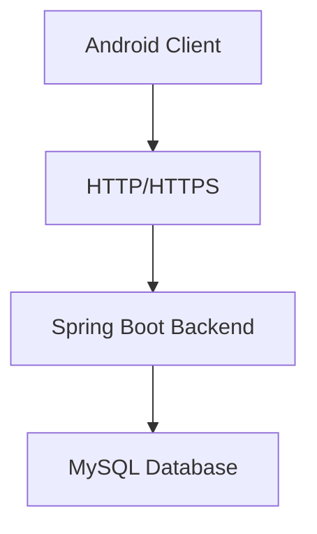
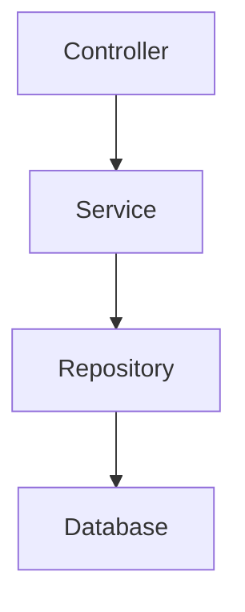
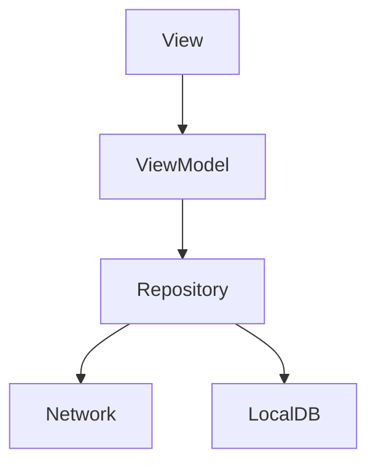
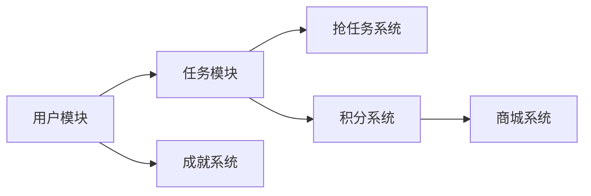
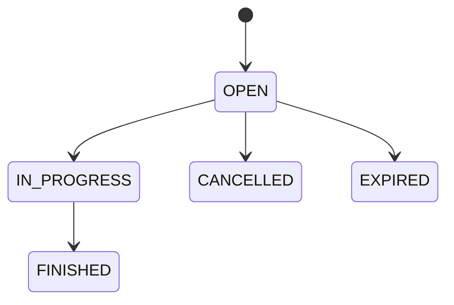
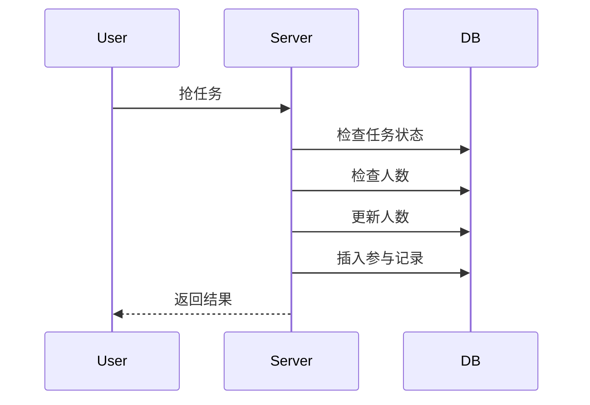
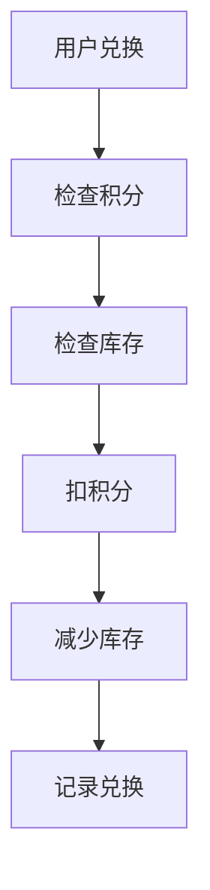
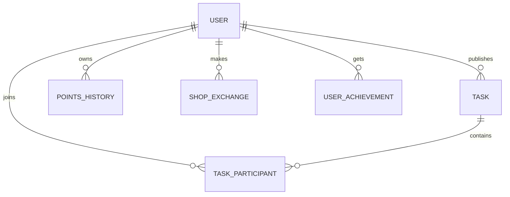
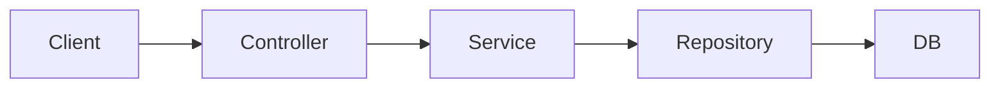
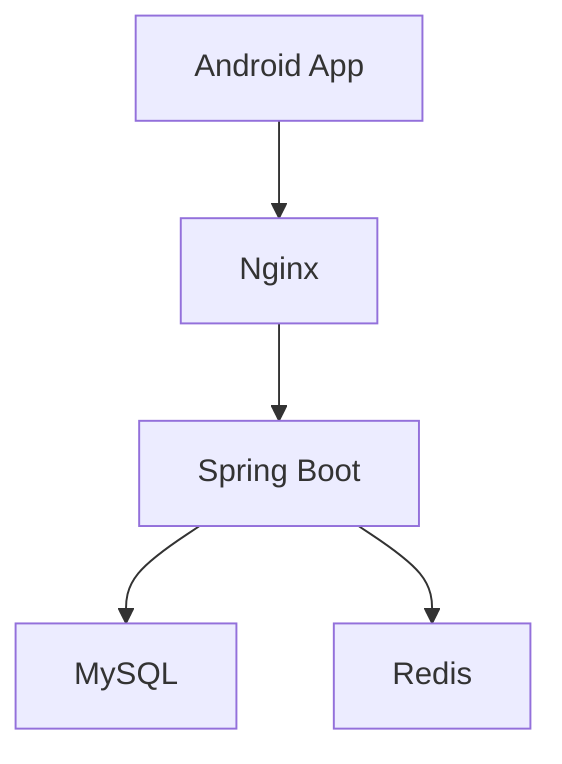

# 架构设计文档

## 1. 系统概述

CampusHub（校园互助任务平台）是一个面向校园场景的任务协作系统，支持用户发布任务、抢任务、完成任务并获取积分奖励，同时提供积分商城与成就系统。

系统采用 **前后端分离架构**：

- 前端：Android 原生应用（Kotlin + MVVM）
- 后端：Spring Boot RESTful 服务
- 数据库：MySQL

---

## 2. 总体架构设计



---

### 架构说明
- 客户端（Android）
  - 负责 UI 展示和用户交互
  - 通过 Retrofit 调用后端 API
- 后端（Spring Boot）
  - 提供 RESTful API
  - 处理业务逻辑
  - 进行权限认证（JWT）
- 数据库（MySQL）
  - 存储用户、任务、积分、商城、成就数据

---

## 3. 分层架构设计
### 3.1 后端分层结构



**各层职责**

| 层级         | 作用        |
| ---------- | --------- |
| Controller | 接收请求，返回响应 |
| Service    | 业务逻辑处理    |
| Repository | 数据访问      |
| Entity     | 数据模型      |

### 3.2 前端架构



**各层职责**

| 层级         | 作用                      |
| ---------- | ----------------------- |
| View       | UI展示（Activity/Fragment） |
| ViewModel  | UI逻辑处理                  |
| Repository | 数据统一管理                  |
| Network    | API请求                   |
| LocalDB    | 本地缓存（Room）              |

## 4. 核心业务模块架构

### 4.1 用户模块
功能：
- 注册 / 登录
- JWT认证
- 用户信息管理
- 积分与信用值

### 4.2 任务模块
功能：
- 发布任务
- 查看任务列表
- 任务状态管理
任务状态流转：

### 4.3 抢任务机制

防止超抢：
- 数据库事务
- 乐观锁
- Redis 分布式锁（扩展）
### 4.4 积分系统

积分来源：
- 完成任务
- 成就奖励
- 系统活动

### 4.5 商城系统


### 4.6 成就系统
功能：
- 成就解锁
- 积分奖励
- 用户成长体系

## 5. 数据架构设计

数据库设计详见database.md

### 5.1 核心数据关系

### 5.2 数据设计特点
- 符合第三范式（3NF）
- 使用外键保证数据一致性
- 使用索引优化查询性能
- 使用唯一约束防止重复参与

## 6. API设计
### 6.1 API分层

### 6.2 API分类
| 模块 | 接口                     |
| -- | ---------------------- |
| 用户 | /api/user/*            |
| 任务 | /api/task/*            |
| 积分 | /api/points/*          |
| 商城 | /api/shop/*            |
| 成就 | /api/user/achievements |
### 6.3 统一返回结构
```json
{
  "code": 0,
  "message": "success",
  "data": {}
}
```
## 7. 安全架构设计
### 7.1 认证机制

JWT 认证流程：

1. 用户登录获取 Token
2. 客户端携带 Token 请求
3. 服务端解析 Token

Header：

```
Authorization: Bearer {token}
```
### 7.2 安全策略
- 密码加密（BCrypt）
- Token 过期机制
- 接口权限控制（拦截器）
## 8. 性能与扩展设计
### 8.1 性能优化
- 数据库索引优化
- 分页查询
- 本地缓存（Room）
- Redis 缓存（可扩展）
### 8.2 高并发处理
- 抢任务使用事务 / 锁机制
- 热点数据缓存
- 限流（可扩展）
### 8.3 可扩展功能
- WebSocket（聊天）
- 推荐系统
- 地图定位
## 9. 部署架构设计

## 10. 项目结构设计
**后端**
```
backend
 ├── controller
 ├── service
 ├── repository
 ├── entity
 └── config
```
**前端**
```
android
 ├── ui
 ├── viewmodel
 ├── repository
 ├── network
 └── db
```

## 11. 技术选型确认

- 前端框架：Android Jetpack（Fragment/ViewModel/LiveData）— 官方推荐、可扩展性强、组件化明确
- 后端框架：Spring Boot 3.x — Java生态成熟，快速开发、内置安全与配置支持
- 数据库：MySQL 8.x — 稳定/普及、与 JPA/MyBatis 集成顺畅
- 部署方式：Docker + 本地开发服务器 — 易持续集成、环境隔离、部署一致
