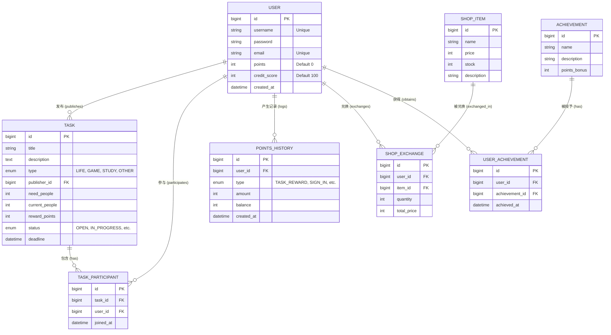

# 数据库设计文档

## 1. 概述
本系统使用 MySQL 8.x 作为关系型数据库，数据表设计遵循 3NF，支持任务发布、抢单、积分、商城、成就等主要业务。

## 2. 设计核心数据表

### 2.1 用户表：`user`
- `id` BIGINT AUTO_INCREMENT PRIMARY KEY
- `username` VARCHAR(64) UNIQUE NOT NULL
- `password` VARCHAR(256) NOT NULL
- `email` VARCHAR(128) UNIQUE
- `points` INT DEFAULT 0
- `credit_score` INT DEFAULT 100
- `created_at` DATETIME DEFAULT CURRENT_TIMESTAMP
- `avatar_url` VARCHAR(256)

### 2.2 任务表：`task`
- `id` BIGINT AUTO_INCREMENT PRIMARY KEY
- `title` VARCHAR(128) NOT NULL
- `description` TEXT
- `type` ENUM('LIFE','GAME','STUDY','OTHER') DEFAULT 'LIFE'
- `publisher_id` BIGINT NOT NULL
- `need_people` INT NOT NULL DEFAULT 1
- `current_people` INT NOT NULL DEFAULT 0
- `reward_points` INT NOT NULL DEFAULT 0
- `status` ENUM('OPEN','IN_PROGRESS','FINISHED','CANCELLED','EXPIRED') DEFAULT 'OPEN'
- `deadline` DATETIME
- `created_at` DATETIME DEFAULT CURRENT_TIMESTAMP
- 外键：`publisher_id` -> `user(id)`

### 2.3 任务参与表：`task_participant`
- `id` BIGINT AUTO_INCREMENT PRIMARY KEY
- `task_id` BIGINT NOT NULL
- `user_id` BIGINT NOT NULL
- `joined_at` DATETIME DEFAULT CURRENT_TIMESTAMP
- 唯一索引 `(task_id,user_id)`
- 外键：`task_id`->`task(id)`、`user_id`->`user(id)`

### 2.4 积分历史表：`points_history`
- `id` BIGINT AUTO_INCREMENT PRIMARY KEY
- `user_id` BIGINT NOT NULL
- `type` ENUM('TASK_REWARD','SHOP_EXCHANGE','SIGN_IN','OTHER')
- `amount` INT NOT NULL
- `balance` INT NOT NULL
- `description` VARCHAR(256)
- `created_at` DATETIME DEFAULT CURRENT_TIMESTAMP
- 外键：`user_id` -> `user(id)`

### 2.5 商城商品表：`shop_item`
- `id` BIGINT AUTO_INCREMENT PRIMARY KEY
- `name` VARCHAR(128) NOT NULL
- `price` INT NOT NULL
- `stock` INT NOT NULL DEFAULT 0
- `description` VARCHAR(256)
- `created_at` DATETIME DEFAULT CURRENT_TIMESTAMP

### 2.6 兑换记录表：`shop_exchange`
- `id` BIGINT AUTO_INCREMENT PRIMARY KEY
- `user_id` BIGINT NOT NULL
- `item_id` BIGINT NOT NULL
- `quantity` INT DEFAULT 1
- `total_price` INT NOT NULL
- `created_at` DATETIME DEFAULT CURRENT_TIMESTAMP
- 外键：`user_id`->`user(id)`、`item_id`->`shop_item(id)`

### 2.7 成就表：`achievement`
- `id` BIGINT AUTO_INCREMENT PRIMARY KEY
- `name` VARCHAR(128) NOT NULL
- `description` VARCHAR(256)
- `points_bonus` INT DEFAULT 0
- `icon_url` VARCHAR(256)
- `created_at` DATETIME DEFAULT CURRENT_TIMESTAMP

### 2.8 用户成就表：`user_achievement`
- `id` BIGINT AUTO_INCREMENT PRIMARY KEY
- `user_id` BIGINT NOT NULL
- `achievement_id` BIGINT NOT NULL
- `achieved_at` DATETIME DEFAULT CURRENT_TIMESTAMP
- 唯一索引 `(user_id,achievement_id)`
- 外键：`user_id`->`user(id)`、`achievement_id`->`achievement(id)`

---

## 3. ER 图



---

## 4. 数据库建表 SQL

```sql
CREATE TABLE `user` (
  `id` BIGINT AUTO_INCREMENT PRIMARY KEY,
  `username` VARCHAR(64) NOT NULL UNIQUE,
  `password` VARCHAR(256) NOT NULL,
  `email` VARCHAR(128) UNIQUE,
  `points` INT NOT NULL DEFAULT 0,
  `credit_score` INT NOT NULL DEFAULT 100,
  `avatar_url` VARCHAR(256),
  `created_at` DATETIME NOT NULL DEFAULT CURRENT_TIMESTAMP
) ENGINE=InnoDB DEFAULT CHARSET=utf8mb4;

CREATE TABLE `task` (
  `id` BIGINT AUTO_INCREMENT PRIMARY KEY,
  `title` VARCHAR(128) NOT NULL,
  `description` TEXT,
  `type` ENUM('LIFE','GAME','STUDY','OTHER') NOT NULL DEFAULT 'LIFE',
  `publisher_id` BIGINT NOT NULL,
  `need_people` INT NOT NULL DEFAULT 1,
  `current_people` INT NOT NULL DEFAULT 0,
  `reward_points` INT NOT NULL DEFAULT 0,
  `status` ENUM('OPEN','IN_PROGRESS','FINISHED','CANCELLED','EXPIRED') NOT NULL DEFAULT 'OPEN',
  `deadline` DATETIME,
  `created_at` DATETIME NOT NULL DEFAULT CURRENT_TIMESTAMP,
  INDEX `idx_publisher` (`publisher_id`),
  CONSTRAINT `fk_task_user` FOREIGN KEY (`publisher_id`) REFERENCES `user` (`id`) ON DELETE CASCADE
) ENGINE=InnoDB DEFAULT CHARSET=utf8mb4;

CREATE TABLE `task_participant` (
  `id` BIGINT AUTO_INCREMENT PRIMARY KEY,
  `task_id` BIGINT NOT NULL,
  `user_id` BIGINT NOT NULL,
  `joined_at` DATETIME NOT NULL DEFAULT CURRENT_TIMESTAMP,
  UNIQUE KEY `uniq_task_user` (`task_id`,`user_id`),
  INDEX `idx_task` (`task_id`),
  INDEX `idx_user` (`user_id`),
  CONSTRAINT `fk_participant_task` FOREIGN KEY (`task_id`) REFERENCES `task` (`id`) ON DELETE CASCADE,
  CONSTRAINT `fk_participant_user` FOREIGN KEY (`user_id`) REFERENCES `user` (`id`) ON DELETE CASCADE
) ENGINE=InnoDB DEFAULT CHARSET=utf8mb4;

CREATE TABLE `points_history` (
  `id` BIGINT AUTO_INCREMENT PRIMARY KEY,
  `user_id` BIGINT NOT NULL,
  `type` ENUM('TASK_REWARD','SHOP_EXCHANGE','SIGN_IN','OTHER') NOT NULL,
  `amount` INT NOT NULL,
  `balance` INT NOT NULL,
  `description` VARCHAR(256),
  `created_at` DATETIME NOT NULL DEFAULT CURRENT_TIMESTAMP,
  INDEX `idx_user` (`user_id`),
  CONSTRAINT `fk_points_user` FOREIGN KEY (`user_id`) REFERENCES `user` (`id`) ON DELETE CASCADE
) ENGINE=InnoDB DEFAULT CHARSET=utf8mb4;

CREATE TABLE `shop_item` (
  `id` BIGINT AUTO_INCREMENT PRIMARY KEY,
  `name` VARCHAR(128) NOT NULL,
  `price` INT NOT NULL,
  `stock` INT NOT NULL DEFAULT 0,
  `description` VARCHAR(256),
  `created_at` DATETIME NOT NULL DEFAULT CURRENT_TIMESTAMP
) ENGINE=InnoDB DEFAULT CHARSET=utf8mb4;

CREATE TABLE `shop_exchange` (
  `id` BIGINT AUTO_INCREMENT PRIMARY KEY,
  `user_id` BIGINT NOT NULL,
  `item_id` BIGINT NOT NULL,
  `quantity` INT NOT NULL DEFAULT 1,
  `total_price` INT NOT NULL,
  `created_at` DATETIME NOT NULL DEFAULT CURRENT_TIMESTAMP,
  INDEX `idx_user` (`user_id`),
  INDEX `idx_item` (`item_id`),
  CONSTRAINT `fk_exchange_user` FOREIGN KEY (`user_id`) REFERENCES `user`(`id`) ON DELETE CASCADE,
  CONSTRAINT `fk_exchange_item` FOREIGN KEY (`item_id`) REFERENCES `shop_item`(`id`) ON DELETE CASCADE
) ENGINE=InnoDB DEFAULT CHARSET=utf8mb4;

CREATE TABLE `achievement` (
  `id` BIGINT AUTO_INCREMENT PRIMARY KEY,
  `name` VARCHAR(128) NOT NULL,
  `description` VARCHAR(256),
  `points_bonus` INT NOT NULL DEFAULT 0,
  `icon_url` VARCHAR(256),
  `created_at` DATETIME NOT NULL DEFAULT CURRENT_TIMESTAMP
) ENGINE=InnoDB DEFAULT CHARSET=utf8mb4;

CREATE TABLE `user_achievement` (
  `id` BIGINT AUTO_INCREMENT PRIMARY KEY,
  `user_id` BIGINT NOT NULL,
  `achievement_id` BIGINT NOT NULL,
  `achieved_at` DATETIME NOT NULL DEFAULT CURRENT_TIMESTAMP,
  UNIQUE KEY `uniq_user_achievement` (`user_id`,`achievement_id`),
  INDEX `idx_user` (`user_id`),
  INDEX `idx_achievement` (`achievement_id`),
  CONSTRAINT `fk_userachievement_user` FOREIGN KEY (`user_id`) REFERENCES `user`(`id`) ON DELETE CASCADE,
  CONSTRAINT `fk_userachievement_achievement` FOREIGN KEY (`achievement_id`) REFERENCES `achievement`(`id`) ON DELETE CASCADE
) ENGINE=InnoDB DEFAULT CHARSET=utf8mb4;
```

---

## 5. 技术选型确认（层级与理由）

- 前端框架：Android Jetpack（Fragment/ViewModel/LiveData）— 官方推荐、可扩展性强、组件化明确
- 后端框架：Spring Boot 3.x — Java生态成熟，快速开发、内置安全与配置支持
- 数据库：MySQL 8.x — 稳定/普及、与 JPA/MyBatis 集成顺畅
- 部署方式：Docker + 本地开发服务器 — 易持续集成、环境隔离、部署一致
